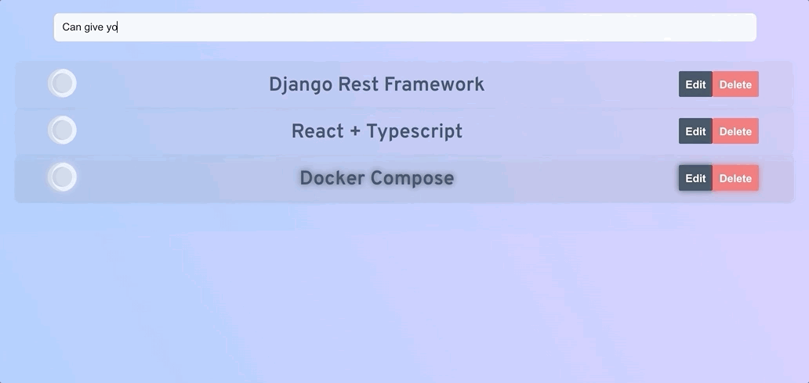

# Todo App with React and Django

## This Project Uses

- [`create-react-app`](https://npm.im/create-react-app)
- Typescript
- [`SWR`](https://github.com/vercel/swr)
- `Django`
- `Docker` and `docker-compose`

## Running

1. `docker-compose build`
1. `docker-compose up`
1. There should now be two servers running:

- [http://127.0.0.1:5000](http://127.0.0.1:8000) is the Django app
- [http://127.0.0.1:3000](http://127.0.0.1:3000) is the React app
